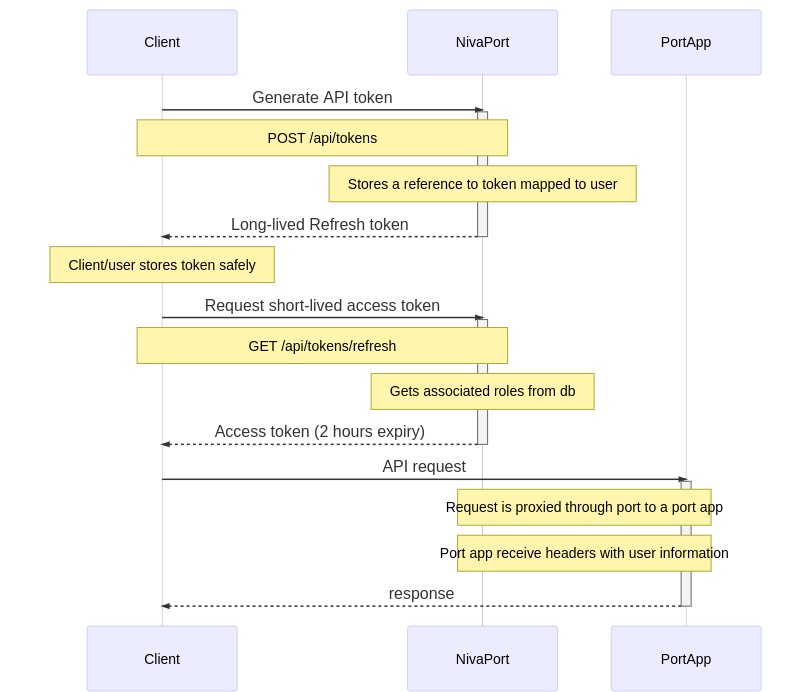

# niva-api-client-python
Client library for interacting with API's exposed at https://data.niva.no. Handles common tasks such as authentication

## Package status

This library is currently under development and there will probably be breaking changes. 

## Contact

Please contact us at [cloud@niva.no](mailto:cloud@niva.no) if you are interested in using our API's or need any help. 


## Authentication

API users need to obtain an API token by logging in to https://data.niva.no/ and generate an API token.

The API token is granted the same roles as the user who generated it. The API token is used to generate a short-lived access token (2 hours). The figure below describes the sequence of requests when interacting with NIVA API's:




## Terminology

- NivaPort: authentication portal for NIVA apps
- Port apps: Applications running in NIVA's cloud environment 
- Refresh token: token used to obtain short-lived access tokens. Can not be used by itself to access the API's
- Access token: short-lived token granting access to API's
  - token roles are inherited by the user who generated the refresh token by the time of refreshing. If a user has been granted new roles, she will need to request a new access token.
  
## Apps

- Port apps are available on their own subdomain https://app.data.niva.no

## Example


### Optain access token
This example assumes a refresh token string as environment variable NIVA_REFRESH_TOKEN
```python
import os

import requests

from api_client import access_token, api_headers
from domain.app import NivaApp
from environments import PORT_URL_PRODUCTION
from url_utils import app_url

# read token from environment variable
token = access_token(os.environ["NIVA_REFRESH_TOKEN"])

# optains headers to be used in following requests
headers = api_headers(token)

# get available apps
res = requests.get(f"{PORT_URL_PRODUCTION}/api/users/apps", headers=headers)
res.raise_for_status()

body = res.json()
for app in body["apps"]:
    portApp = NivaApp(**app)
    print(portApp.title, app_url(portApp))
```

This will print the following (depends on your own users roles and available apps):
```
Grafana https://grafana.data.niva.no
begroing https://begroing.data.niva.no
ODM2 GraphQL API https://odm2-graphql-api.data.niva.no
Niva data upload https://niva-data-upload.data.niva.no
```


## Environments

Niva API's are exposed on the following urls:

- https://data.niva.no (production environment)
- https://test.niva.no (test environment)
